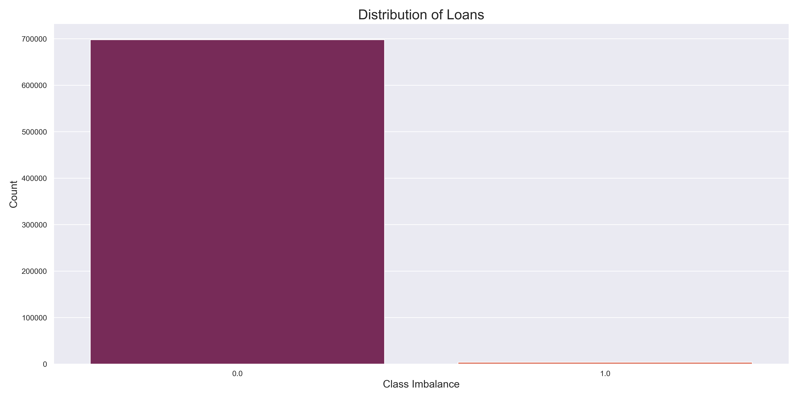
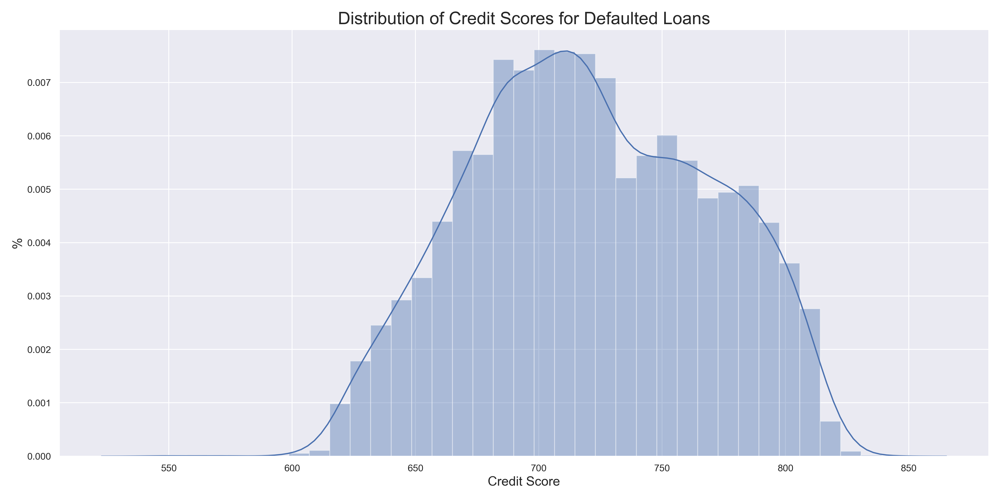
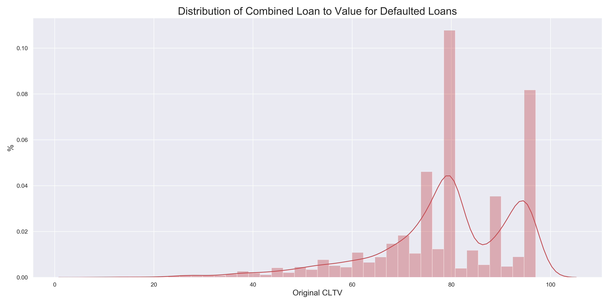
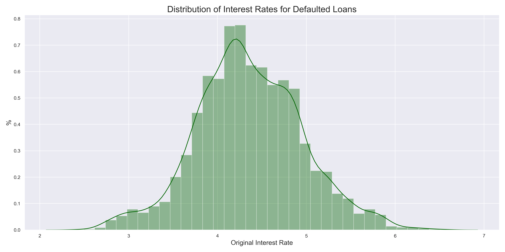
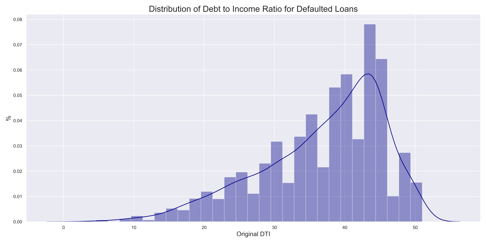

# Single-Family-Home-Credit-Risk-Model

Capstone Project
By Shaunil Maharaj

## Introduction

As part of a larger effort to increase transparency, Freddie Mac have made loan-level credit performance data on fully amortized fixed-rate mortgages that either company purchased or guaranteed from 1999 to 2018, available to all in an effort to boost transparency. This effort will allow investors to build accurate performance models in support of risk sharring initiatives by the Federal Housing Finance Agency(FIFA).

With another housing recession possibly imminent due to shelter-in-place orders and massive protest countryside at the time of this writing. divide this data we will create a credit risk model that can predict loan defaults within 2 years. We will want to focus on creating a model with the highest overall area under the curve (AOC) score, which will give us a metric on how our models are performing.

### Data

The dataset covers around 27.8 million fixed-rate mortgages (including HARP loans) originated between January 1, 1999 and December 31, 2018. Monthly loan performance data, including credit performance information up to and including property disposition, is being disclosed through June 30, 2019. Specific credit performance information in the dataset includes voluntary prepayments and loans that were Foreclosure Alternatives and REOs. Specific actual loss data in the dataset includes net sales proceeds, MI recoveries, non-MI recoveries, expenses, current deferred UPB, and due date of last paid installment.

The primary dataset is divided into two text files for each acquisition quarter, starting in 1999. The “Acquisition” file
includes static mortgage loan data at the time of the mortgage loan’s origination and delivery to Freddie Mac. The
“Performance” file provides the monthly performance data of each mortgage loan since the time of Fredie Mac
acquisition up until its current status as of the previous quarter, until the mortgage loan has been liquidated (e.g., paidoff, repurchased, short sale, etc.), or in the event of a real estate owned (REO) property, until expenses and proceeds
have been collected following disposal of the property. In addition, certain data attributes will be updated to reflect
new terms, if applicable, as a result of a modification. 

## Exporatory Data Analysis

The data will come in two data sets. The loan origination dataset and the monthly performance dataset. Due the large size of the data, it is best to have all of the data seletion, concatenation, cleaning, and splitting done in a python executable file. 

Using the [data guide](http://www.freddiemac.com/fmac-resources/research/pdf/user_guide.pdf), a list of column headers can be applied to the data. Then columns that offered no real value to our purposes was dropped. We will then split the data into training and testing. The training dataset will include relevant data on around 701,580 loans issued and garaunteed by Freddie Mac from 2016-2017. Relevant columns include credit score, first time buyer status, property type, occupancy status, number of borrowers. 

Other columns will look more closely at will is the 'zero balance code' column with has our dependent variable: 0 for a current paid loan and 1 for a loan that defaulted. As we can see, we have a severe class imbalance:

Let's take a look at our distributions. First we will look at the credit score distribution of defaulted loans:

We can see that the credit score is evenly distributed meaning that borrowers with around 700-750 credit score were the main group of borrowers that defaulted which is expected as they are the largest group amongst borrowers.

The Combined loan to value ratio considers the amount borrowed to the value of the home.

We are seeing a negative skew, indicated that borrowers with larger loan to value ratio's tended to default on there loan more than other groups. This could be an oversight of issuers, or a tell of a deeper problem with loan issuance.

Let's check to see the distribution of interest rates among defaulted borrowers:

No skew, which makes sense as the credit score would be the main driver of the interest rate for most borrowers.

Finally we can see the debt to income ratio of defaulted borrowers:

As we can see, we have another negative skew, signifying the trend that those with lower income ratios and higher debt or more likely to default. This is concerning considering our distribution of credit scores and interest rates of defaulted borrowers are normal. 

# Results

## Neural Networks

# Conclusion

