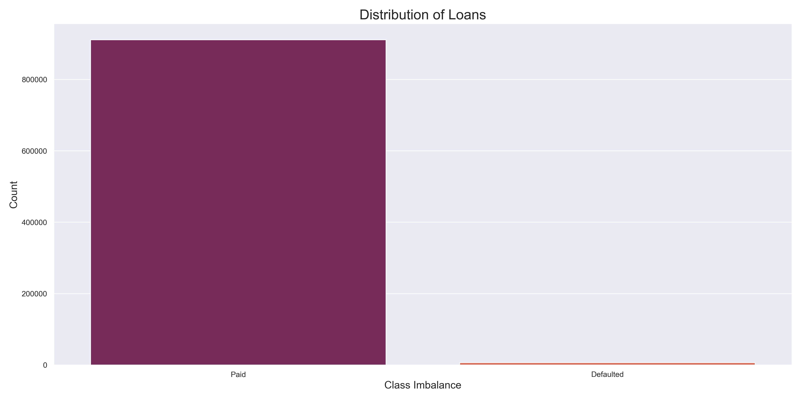
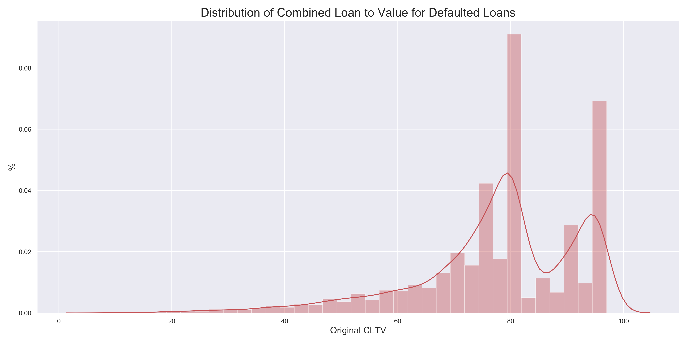

# Single-Family-Home-Credit-Risk-Model

By Shaunil Maharaj

## Introduction

As part of a larger effort to increase transparency, Freddie Mac have made loan-level credit performance data on fully amortized fixed-rate mortgages that either company purchased or guaranteed from 1999 to 2018, available to all in an effort to boost transparency. This effort will allow investors to build accurate performance models in support of risk sharring initiatives by the Federal Housing Finance Agency(FIFA).

With another housing recession possibly imminent due to shelter-in-place orders and massive protest countryside at the time of this writing. We will want to focus on creating a model with the highest overall area under the curve (AOC) score, which will give us a metric on how our models are performing in order to select the best one. In particular, a model that can predict defaults on loans which are less than 2 years old would be ideal. We will then explore all of the metrics, as with Mortgage Backed Securities(MBS) there are many different financial products for whether a loan reached default or not.

### Data

The dataset covers around 27.8 million fixed-rate mortgages (including HARP loans) originated between January 1, 1999 and December 31, 2018. Monthly loan performance data, including credit performance information up to and including property disposition, is being disclosed through June 30, 2019. Specific credit performance information in the dataset includes voluntary prepayments and loans that were Foreclosure Alternatives and REOs. Specific actual loss data in the dataset includes net sales proceeds, MI recoveries, non-MI recoveries, expenses, current deferred UPB, and due date of last paid installment.

The primary dataset is divided into two text files for each acquisition quarter, starting in 1999. The “Acquisition” file
includes static mortgage loan data at the time of the mortgage loan’s origination and delivery to Freddie Mac. The
“Performance” file provides the monthly performance data of each mortgage loan since the time of Fredie Mac
acquisition up until its current status as of the previous quarter, until the mortgage loan has been liquidated (e.g., paidoff, repurchased, short sale, etc.), or in the event of a real estate owned (REO) property, until expenses and proceeds
have been collected following disposal of the property. In addition, certain data attributes will be updated to reflect
new terms, if applicable, as a result of a modification. 

## Exporatory Data Analysis

The data, as explained, will come in two data sets. The loan origination dataset and the monthly performance dataset. Using the [data guide](http://www.freddiemac.com/fmac-resources/research/pdf/user_guide.pdf), a list of column headers can be applied to the data. Then columns that offered no real value to our purposes can be dropped. We will collect just the loan age and zero balance columns from the monthly performance data. Zero balance will be our dependent variable for which we will try to predict and we will use the rest of the columns as features. Other columns we will look more closely at is the 'zero balance code' column with has our dependent variable: 0 for a current paid loan and 1 for a loan that defaulted. As we can see, we have a severe class imbalance:

Let's take a look at our distributions. First we will look at the credit score distribution of defaulted loans:

We can see that the credit score is evenly distributed meaning that borrowers with around 700-750 credit score were the main group of borrowers that defaulted which is expected as they are the largest group amongst borrowers.

The Combined loan to value ratio considers the amount borrowed to the value of the home.

We are seeing a negative skew, indicated that borrowers with larger loan to value ratio's tended to default on there loan more than other groups. This could be an oversight of issuers, or a tell of a deeper problem with loan issuance.

Let's check to see the distribution of interest rates among defaulted borrowers:

No skew, which makes sense as the credit score would be the main driver of the interest rate for most borrowers.

Finally we can see the debt to income ratio of defaulted borrowers:

As we can see, we have another negative skew, signifying the trend that those with lower income ratios and higher debt or more likely to default. This is concerning considering our distribution of credit scores and interest rates of defaulted borrowers are normal. 

# Results

## Preliminary Results

Running the models with no class balancing performed but nothing special.

With XGBoost being the clear winner.

## Balanced Approached

We will use undersampling in order to deal with the large disparity in class balance:

Performance did increase, however the most accurate model did not improve.

As we can see, XGBoost remained at 83.2%.

## Clustered Approach

Using a clustered sampled approach gave less than ideal results.

## Randomly Sampled Defaulted Loans From Previous Years

We can try to improve our model by extracting all of the defaulted from previous years to balance our dependent variable:

Unfortunately many of the sampling techniques failed to improve our model very much.

It seems XGBoost is the best overall performer. Hyperparameter optimization was completed, however this added very little in terms of accuracy under the curve.

# Metrics

We had an overall accuracy under the curve score 83.7%.

# Conclusion

It is possible to predict defaults, but these type of problems require a large sample size to be accurate.

